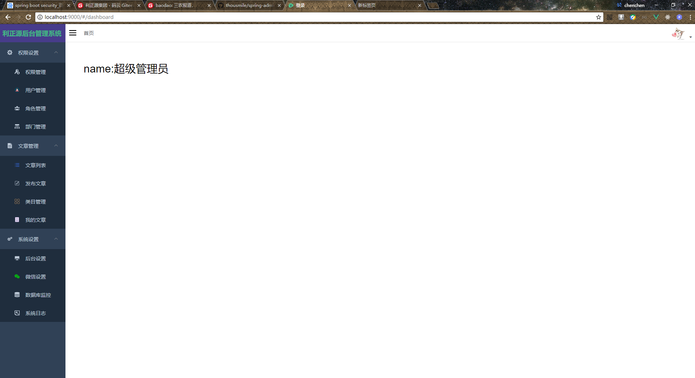
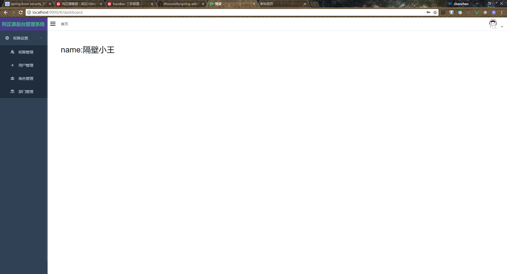

# spring boot security jwt 整合vue-admin-template

首先感谢[PanJiaChen](https://github.com/PanJiaChen) 的 vue-admin-template 模板，我是一名java程序员，所以前端的技术不怎么样。vue.js也只是会用一点，非常感谢[PanJiaChen](https://github.com/PanJiaChen) 的模板支持。

**已经整合好的模板地址：https://github.com/thousmile/spring-security-jwt-vue-admin**

如果大家觉得写的不错，就请点亮我[GitHub](https://github.com/thousmile/spring-admin-vue)的心心。非常感谢！

如果大家在搭建过程中遇到问题，

可以去看我写的教程：https://github.com/thousmile/spring-admin-vue

环境需求：jdk 8，redis，mysql

```
1.导入数据库  baodao.sql
2.修改  application-dev.yml 中Redis 和 mysql配置信息
3.修改阿里云OSS配置文件 aliyunoss.properties
4.npm安装vue
  1. npm install 
  2. npm run dev
```

效果

这是超级管理员拥有的权限




这是管理员拥有的权限

